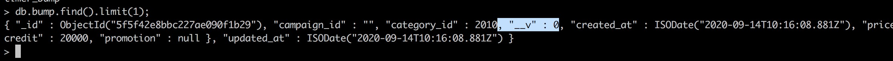

# Pool
  Store, add and quantile numeric values. I use one file to store all data relative to pool. Every action add value to one array, I store info into each file in folder *wals* (write ahead log). It guaranteed the pool not lose when server down. 

# API
- POST locahost:8080/add 
- GET locahost:8080?id=1 
- POST locahost:8080/quantile 

# How to use
- Run a http server: make start
- Add values to poolId:
```
curl --location --request POST 'localhost:8080/add' \
--header 'Content-Type: application/json' \
--data-raw '{
    "poolId":2,
    "poolValues":[1,3]
}'
```
- Quantile a poolId:
```
curl --location --request POST 'localhost:8080/quantile' \
--header 'Content-Type: application/json' \
--data-raw '{
    "poolId":2,
    "percentile":99.5

}'
```
- Get values by poolId:
```
curl --location --request GET 'localhost:8080?id=1'
```

# Tree file
```
.
├── Makefile
├── README.md
├── data
│   └── pool.csv
├── handler.go
├── main.go
├── middleware.go
├── pool.go
├── storage-writer.go
└── wals
    ├── 1624726111108099000
    ├── 1624729753556994000
    └── 1624768936778674000
```
- Makefie: contain command to start program.
- data/pool.csv: checkPointLSN, poolId and poolValues are store in this file.
	- checkponitLSN allow is the first row in file.
	- Each row below checkpointLSN is pair poolId and poolVaule.
- handler.go: handle request from client.
- main.go: steup and start http server. 
- middleware.go: check method of request, and set header `Content-Type: application/json`.
- pool.go: store pool and add action to file. When start program, it load infor from file to buffer.
- storage-writer.go: background goroutine write pool buffers to file.
- wals: each file in this folder is info about add action. The file contains,pair poolId and poolValues, 1 row. The name of file is time of action take place.

# How it resilience

